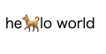

# dogwalk
dog walking animation



### Requirements
* npm

### Usage
**install**
```bash
npm install TakutoYoshikai/dogwalk
```

**import library**
```html
<script src="./node_modules/dogwalk/index.js"></script>
```

**name class**
```html
<p class="dogwalk">Hello World.</p>
<p class="dogwalk">I love dogs.</p>
```

**run DogWalk**
```html
<script>
  DogWalk();
</script>
```

### Contributing

Contributions are what make the open source community such an amazing place to learn, inspire, and create. Any contributions you make are greatly appreciated.

If you have a suggestion that would make this better, please fork the repo and create a pull request. You can also simply open an issue with the tag "enhancement". Don't forget to give the project a star! Thanks again!

1. Fork the Project
2. Create your Feature Branch (git checkout -b feature/AmazingFeature)
3. Commit your Changes (git commit -m 'Add some AmazingFeature')
4. Push to the Branch (git push origin feature/AmazingFeature)
5. Open a Pull Request

### License
MIT License
